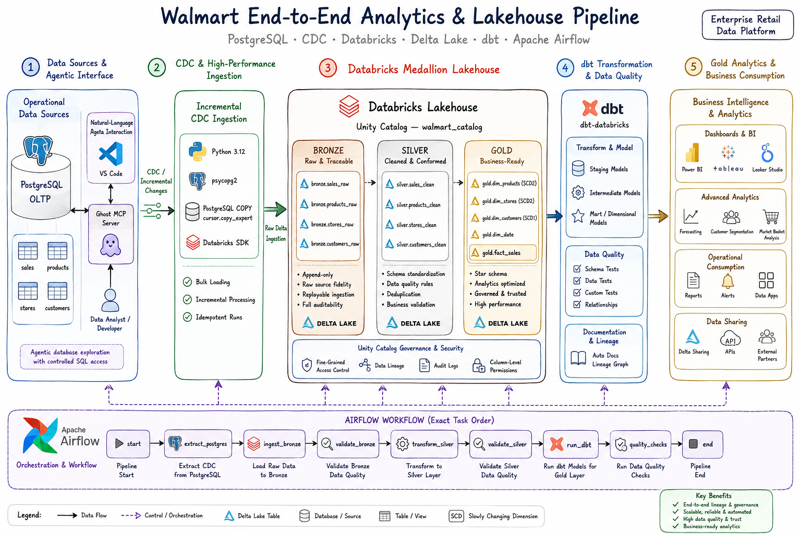
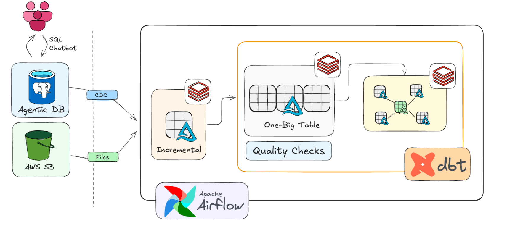
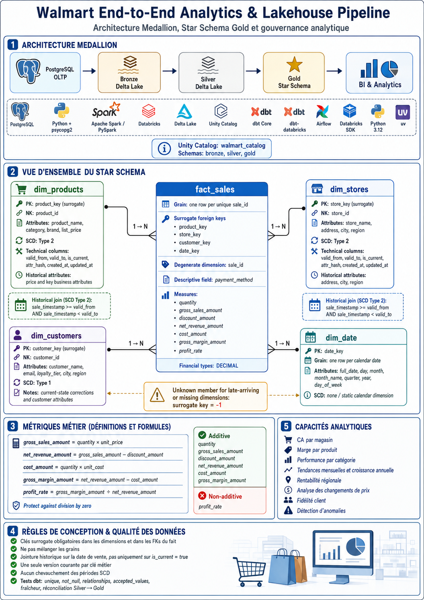
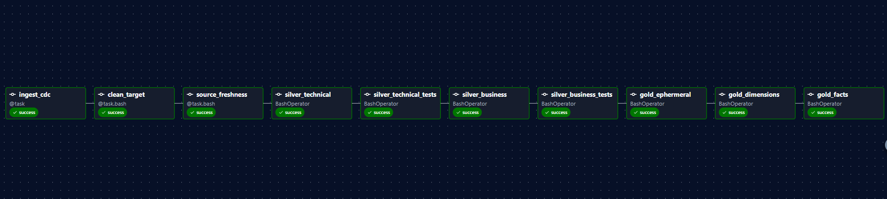

# 🛒 Walmart End-to-End Analytics & Lakehouse Pipeline

### Production-Inspired Retail Data Engineering Platform

**PostgreSQL • CDC • Databricks • Delta Lake • dbt • Apache Airflow**

*A complete retail data platform that transforms operational transactions into governed, tested, and analytics-ready data products.*

---

## 📌 Executive Summary

**Walmart End-to-End Analytics & Lakehouse Pipeline** is an enterprise-style data engineering project that reproduces the essential components of a modern retail analytics platform.

Operational data starts in PostgreSQL. New and modified records are captured incrementally, processed on Databricks with Apache Spark, stored in Delta Lake, transformed and tested with dbt, and orchestrated with Apache Airflow. The Gold layer exposes a Star Schema designed for business intelligence and analytical reporting.

### What the project delivers

- A PostgreSQL operational source for sales, products, stores, and customers
- High-performance source loading with Python, `psycopg2`, and PostgreSQL `COPY`
- Incremental Change Data Capture instead of repeated full reloads
- A Databricks Medallion architecture with Bronze, Silver, and Gold layers
- Reliable Delta Lake storage and incremental upserts
- SCD Type 1 and SCD Type 2 historical processing
- A Gold Star Schema centered on `fact_sales`
- Modular transformations, snapshots, tests, documentation, and lineage with dbt
- Hourly workflow orchestration with Apache Airflow
- Remote Databricks job execution and monitoring with the Databricks SDK
- Central governance through Unity Catalog and `walmart_catalog`
- Secure configuration through environment variables and `.gitignore`

### Business value

| Business need | Engineering response | Result |
|---|---|---|
| Reliable retail reporting | Tested facts and conformed dimensions | Consistent revenue, margin, quantity, and profitability indicators |
| Historical analysis | SCD Type 2 for products and stores | Sales remain connected to the attributes valid at the transaction date |
| Faster refreshes | Incremental CDC and Delta Lake upserts | Less data movement and shorter processing time |
| Trusted data | dbt tests, freshness checks, and reconciliation | Defects are detected before Gold publication |
| Operational resilience | Airflow retries and Databricks run monitoring | Failed stages remain visible and recoverable |
| Governance | Unity Catalog, lineage, and controlled access | Data products are discoverable, traceable, and protected |

> [!NOTE]
> This is an educational portfolio project inspired by enterprise retail analytics practices. The project is not affiliated with or endorsed by Walmart Inc.

---

## 🖼️ End-to-End Platform Architecture

  
   
  <b>Figure 1.</b> Complete data journey from PostgreSQL to Databricks, dbt, Airflow, and analytical consumption.

### Architecture explained

1. **PostgreSQL stores operational data.** The source system contains sales, products, stores, and customers.
2. **Ghost MCP provides agentic access.** VS Code can interact with PostgreSQL through controlled natural-language requests.
3. **CDC captures changes.** Only new and modified records are transferred to the analytical platform.
4. **Bronze preserves raw data.** Source-aligned records are stored with ingestion and lineage metadata.
5. **Silver creates trusted entities.** Records are typed, cleaned, deduplicated, validated, and historized.
6. **Gold publishes analytical models.** Dimensions and facts expose stable business definitions.
7. **dbt manages transformation quality.** Models, snapshots, tests, documentation, and lineage are version controlled.
8. **Airflow controls execution.** Tasks run in dependency order and remote Databricks jobs are monitored.
9. **Business users consume certified datasets.** Gold models support dashboards, reports, and advanced analytics.

---

## 🧭 Conceptual Platform View

  
   
  <b>Figure 2.</b> Conceptual view of agentic access, incremental ingestion, Databricks processing, dbt, and Airflow.

### Main responsibilities

| Area | Responsibility |
|---|---|
| **Agentic database** | Supports controlled natural-language exploration of PostgreSQL |
| **Incremental ingestion** | Transfers only new or modified source records |
| **Databricks processing** | Executes distributed transformations and stores Delta tables |
| **dbt transformation** | Converts technical datasets into documented analytical models |
| **Quality checks** | Prevents invalid, stale, duplicated, or inconsistent data from reaching Gold |
| **Airflow orchestration** | Coordinates dependencies, retries, monitoring, and final pipeline status |

> [!IMPORTANT]
> If the conceptual image contains an AWS S3 block, that block represents an optional file-ingestion extension. The implemented core pipeline uses PostgreSQL as the operational source and Databricks Delta Lake as the analytical storage platform.

---

## 🗄️ Source System and Agentic Access

### PostgreSQL OLTP

PostgreSQL represents the operational retail database and remains the authoritative source of transactional data.

| Source table | Responsibility |
|---|---|
| `sales` | Stores transaction time, quantity, price, cost, discount, and payment method |
| `products` | Describes products, categories, brands, and list prices |
| `stores` | Describes store names, addresses, cities, and regions |
| `customers` | Describes customer profiles and loyalty attributes |

The Lakehouse does not replace PostgreSQL. It receives operational changes and reorganizes the data for analytical use.

### Ghost MCP and VS Code

Ghost MCP connects VS Code to PostgreSQL through the Model Context Protocol. It supports schema discovery, assisted SQL exploration, relationship analysis, development, and debugging.

The agentic interface complements the engineering workflow but does not replace deterministic pipelines, dbt models, tests, permissions, or code review. Credentials remain outside the source code.

---

## 🚀 Ingestion and Change Data Capture

### High-performance source loading

Python and `psycopg2` are used to communicate with PostgreSQL. Large volumes are loaded with PostgreSQL `COPY` through `cursor.copy_expert`, avoiding slow row-by-row inserts.

### Incremental CDC

The pipeline processes new and updated records instead of rebuilding every dataset during each execution.

**Benefits:**

- Less data transferred from PostgreSQL
- Faster Databricks processing
- Lower compute consumption
- Better scalability as the source grows
- Clear tracking of modified business entities
- Safer retries through idempotent processing

Source timestamps and ingestion metadata determine change order. Checksums help identify material changes and avoid unnecessary updates.

---

## 🥉🥈🥇 Medallion Lakehouse Architecture

The Lakehouse is governed under Unity Catalog through:

- `walmart_catalog.bronze`
- `walmart_catalog.silver`
- `walmart_catalog.gold`

Each layer has one clear responsibility.

### 🥉 Bronze: Raw, Traceable, Replayable

Bronze is the immutable landing layer. It stores source-aligned Delta records before business transformation.

**Main responsibilities:**

- Append-only ingestion
- Preservation of original source values
- Raw Delta table storage
- Batch and source traceability
- Checksum-based change identification
- Replay support after downstream failures
- Separation between ingestion and business logic

**Audit metadata:**

| Metadata | Purpose |
|---|---|
| `_ingested_at` | Time at which the record entered the Lakehouse |
| `_source_file` | Source file, batch, or logical ingestion reference |
| `_checksum` | Material-change detection across tracked attributes |
| `_batch_id` | Correlation with Airflow and Databricks executions |
| `_source_system` | Identification of PostgreSQL as the source system |

Bronze does not calculate business metrics. Its role is to protect traceability, replayability, and auditability.

### 🥈 Silver Technical: Clean and Standardized

Silver Technical transforms raw values into dependable technical records.

**Implemented processing:**

- Strict type conversion
- Timestamp normalization
- Text trimming and case standardization
- Null normalization
- Duplicate detection
- Deterministic record selection
- Invalid-value filtering
- Rejected-record quarantine
- CDC upserts with Delta Lake

A sales record is rejected when essential rules fail, for example a missing identifier, non-positive quantity, negative price, negative cost, or unsupported payment method.

### 🥈 Silver Business: Conformed and Historical

Silver Business applies retail rules after technical cleaning.

**Implemented processing:**

- Conformed sales, product, store, and customer entities
- Business-rule validation
- Current-state customer management
- Historical product-price management
- Historical store-location management
- Validity-period control
- Preparation for dimensional modeling

### Slowly Changing Dimensions

**SCD Type 1** keeps the latest corrected state when previous values are not required analytically. Customer corrections overwrite the prior value while retaining the same business identity.

**SCD Type 2** preserves history when previous values matter. Product prices and store locations receive multiple versions containing:

- A surrogate key
- A natural business key
- `valid_from`
- `valid_to`
- `is_current`
- An attribute hash
- Creation and update timestamps

The model prevents overlapping validity periods and allows only one current version for each natural business key.

### 🥇 Gold: Governed Business Data Products

Gold translates trusted Silver entities into a model optimized for business analysis.

**Main responsibilities:**

- Conformed dimensions
- Central sales fact table
- Stable metric definitions
- Historical dimension resolution
- Business-friendly naming
- Analytical relationships
- Certified data products for BI and reporting

---

## ⭐ Gold Star Schema

  
   
  <b>Figure 3.</b> Overview of the Gold Star Schema centered on the sales fact table.

  
   
  <b>Figure 4.</b> Detailed dimensional design, SCD strategy, metrics, quality rules, and analytical capabilities.

### Fact-table grain

The grain of `fact_sales` is:

> **One row per unique completed sale identified by `sale_id`.**

This fixed grain prevents mixed levels of detail, duplicate totals, and inconsistent calculations.

### Central fact: `fact_sales`

| Element | Meaning |
|---|---|
| `sale_id` | Transaction identifier and degenerate dimension |
| `product_key` | Surrogate key of the product version valid at the sale time |
| `store_key` | Surrogate key of the store version valid at the sale time |
| `customer_key` | Surrogate key of the customer dimension |
| `date_key` | Surrogate key of the calendar dimension |
| `payment_method` | Descriptive transaction attribute |
| `quantity` | Number of units sold |
| `gross_sales_amount` | Sales value before discount |
| `discount_amount` | Reduction applied to the transaction |
| `net_revenue_amount` | Revenue after discount |
| `cost_amount` | Extended merchandise cost |
| `gross_margin_amount` | Net revenue minus cost |
| `profit_rate` | Gross margin relative to net revenue |

Financial values use fixed-precision decimal types. Division by zero is prevented when calculating `profit_rate`.

### Dimensions

#### `dim_products`

Describes product name, category, brand, and list price. SCD Type 2 preserves historical price and tracked business changes.

#### `dim_stores`

Describes store name, address, city, and region. SCD Type 2 ensures that a store relocation does not rewrite the context of previous sales.

#### `dim_customers`

Describes customer profile, loyalty tier, city, and region. SCD Type 1 retains the latest corrected customer state.

#### `dim_date`

Provides reusable calendar attributes such as full date, day, week, month, quarter, year, day name, and weekend indicator.

### Historical dimension resolution

Product and store dimensions are joined using the version valid at `sale_timestamp`, not automatically through the latest current record. If no valid dimension is found, the fact uses an **Unknown member** with surrogate key `-1`.

### Certified metrics

| Metric | Definition |
|---|---|
| **Gross sales** | Quantity multiplied by unit price before discount |
| **Net revenue** | Gross sales minus discount amount |
| **Cost amount** | Quantity multiplied by unit cost |
| **Gross margin** | Net revenue minus cost amount |
| **Profit rate** | Gross margin divided by net revenue |

Quantity and monetary amounts are additive. `profit_rate` is non-additive and must be recalculated from aggregated margin and revenue.

---

## 🧩 dbt Analytics Engineering

The dbt project separates transformation logic into clear and testable stages.

| dbt capability | Role in the project |
|---|---|
| **Sources** | Declare upstream datasets and freshness expectations |
| **Staging models** | Rename, type, and standardize source fields |
| **Silver Technical models** | Apply cleaning and technical validation |
| **Silver Business models** | Apply retail rules and historical logic |
| **Ephemeral models** | Reuse logic without creating unnecessary physical tables |
| **Snapshots** | Preserve selected historical dimension changes |
| **Gold dimensions** | Build product, store, customer, and date perspectives |
| **Gold fact** | Publish the final transaction-level sales model |
| **Macros** | Centralize reusable calculations and rules |
| **Tests** | Block publication when critical assumptions fail |
| **Documentation** | Describe models, columns, dependencies, and lineage |

This structure separates source cleaning, business transformation, and analytical presentation.

---

## 🎛️ Apache Airflow Orchestration

  
   
  <b>Figure 5.</b> Successful hourly Airflow execution from CDC ingestion to Gold fact publication.

### Workflow policy

- Schedule: hourly
- Historical catch-up: disabled
- Automatic retries: three
- Concurrent DAG runs: limited to one
- Databricks jobs: submitted and monitored remotely
- Failure behavior: downstream publication stops after a required task fails

### Exact task sequence

| Order | Task | Responsibility |
|---:|---|---|
| 1 | `ingest_cdc` | Triggers the Databricks CDC job and waits for the final status |
| 2 | `clean_target` | Removes previous dbt target artifacts and logs |
| 3 | `source_freshness` | Verifies that upstream data is recent enough |
| 4 | `silver_technical` | Builds standardized technical Silver models |
| 5 | `silver_technical_tests` | Validates technical Silver outputs |
| 6 | `silver_business` | Builds conformed entities and historical business logic |
| 7 | `silver_business_tests` | Validates business rules and relationships |
| 8 | `gold_ephemeral` | Prepares reusable logic required by Gold models |
| 9 | `gold_dimensions` | Builds or snapshots analytical dimensions |
| 10 | `gold_facts` | Publishes the final `fact_sales` model |

### Databricks SDK integration

Airflow acts as the control plane and Databricks acts as the compute plane. The DAG submits the configured Databricks job, captures the run identifier, polls its lifecycle state, waits for termination, and fails the Airflow task when the remote run is unsuccessful.

This keeps distributed processing inside Databricks rather than on the Airflow scheduler.

---

## 🛡️ Data Quality and Governance

### Quality controls

| Control | Risk prevented |
|---|---|
| **Unique** | Duplicate business or surrogate keys |
| **Not null** | Missing identifiers and required measures |
| **Relationships** | Orphan facts with invalid dimension keys |
| **Accepted values** | Unsupported payment methods or business values |
| **Source freshness** | Processing stale source data |
| **Financial reconciliation** | Differences between Silver and Gold totals |
| **Current-record check** | Multiple active SCD versions for one business key |
| **Validity-overlap check** | Ambiguous SCD Type 2 history |
| **Non-negative measures** | Invalid quantities, prices, costs, or discounts |

Critical failures block Gold publication. Invalid source records are quarantined with a clear reason instead of being silently discarded.

### Unity Catalog governance

Unity Catalog provides the central governance boundary for `walmart_catalog`.

- Bronze, Silver, and Gold are isolated into separate schemas
- Permissions can be assigned by engineering and analytical roles
- Managed metadata improves discovery
- Lineage connects upstream data to Gold models
- Ownership and access are controlled centrally
- Audit metadata connects records to processing runs
- Sensitive customer information can be restricted or masked

---

## 🔐 Security and Secret Management

- Databricks host, token, job identifier, and database credentials are read from environment variables
- The real `.env` file is excluded through `.gitignore`
- `.env.example` documents required variables without real secrets
- Credentials are not hard-coded in the Airflow DAG
- Logs must not expose tokens, passwords, or customer data
- Read-only access is preferred for agentic database exploration
- Production environments should use service identities or managed authentication

---

## 📊 Analytical Capabilities

The Gold model supports the principal retail questions expected from the platform:

- Which stores generate the highest revenue and gross margin?
- Which products and categories provide the strongest profitability?
- How do sales evolve by day, month, quarter, and year?
- Which regions perform above or below expectations?
- How do product-price changes affect demand and margin?
- Which customers belong to high-value or loyalty segments?
- Which stores show unusual behavior compared with historical performance?
- How does payment-method usage vary across stores and periods?

The Star Schema keeps these analyses consistent because every report uses the same conformed dimensions and metric definitions.

---

## ⚙️ Performance, Reliability, and Observability

### Performance

- Incremental processing limits unnecessary scans
- Delta Lake upserts modify only changed entities
- Small dimensions remain efficient to join with the sales fact
- Fact access patterns prioritize date, store, and product analysis
- File compaction limits small-file accumulation
- Table statistics support query planning
- A controlled lookback window captures late-arriving events

### Reliability

- Idempotent processing prevents duplicate results after retries
- Airflow blocks downstream tasks after critical failures
- Batch identifiers support cross-system traceability
- Bronze remains available for replay
- SCD validity rules preserve historical correctness
- dbt tests prevent uncertified Gold publication

### Observability

A complete run should expose:

- Airflow DAG and task status
- Databricks job and run identifiers
- Source watermark range
- Input, inserted, updated, rejected, and output counts
- Freshness and quality-test results
- Processing duration
- Latest processed event timestamp
- Sanitized failure messages

---

## 🗂️ Repository Organization

| Directory | Responsibility |
|---|---|
| `Docs/` | Architecture, Star Schema, and Airflow illustrations used by this README |
| `dags/` | Airflow workflow and Databricks job orchestration |
| `dbt_project/` | Sources, models, macros, snapshots, tests, and documentation |
| `notebooks/` | Databricks ingestion, CDC, SCD, and maintenance workloads |
| `scripts/` | PostgreSQL seeding and environment utilities |
| `config/` | Non-secret runtime configuration and data contracts |
| `sql/` | Source DDL and analytical assets |
| `tests/` | Python unit and integration validation |
| `.env.example` | Safe template for required environment variables |
| `.gitignore` | Excludes secrets, environments, caches, logs, and artifacts |
| `pyproject.toml` | Defines the Python project and its dependencies |
| `uv.lock` | Locks reproducible dependency versions |

---

## 🚀 Deployment Overview

### Requirements

- Python 3.12 and `uv`
- PostgreSQL
- Databricks workspace with Unity Catalog
- Databricks compute or SQL Warehouse
- dbt Core with `dbt-databricks`
- Apache Airflow

### Deployment sequence

1. Clone the repository
2. Create the local `.env` from `.env.example`
3. Install locked dependencies with `uv`
4. Create and seed the PostgreSQL source database
5. Configure `walmart_catalog` and its Bronze, Silver, and Gold schemas
6. Validate dbt connectivity and source freshness
7. Build and test the transformation layers
8. Start Airflow and enable the `orchestrate` DAG
9. Monitor the Databricks run and verify Gold outputs

---

## ✅ Definition of Done

A pipeline execution is successful when:

- Expected PostgreSQL changes are present in Bronze
- Bronze records contain the required lineage metadata
- Silver has no unresolved duplicates
- Invalid records are quarantined with a reason
- CDC processing remains idempotent
- SCD Type 2 validity windows do not overlap
- Every natural key has at most one current version
- Gold dimensions and `fact_sales` build successfully
- All blocking dbt tests pass
- Silver and Gold financial totals reconcile
- Every required Airflow task completes successfully
- Authorized users can query the certified Gold models

---

## 👤 Author

### **Amine Ait Ali**

**Data Engineering Student**  
*Modern Data Stack • Lakehouse Architecture • Analytics Engineering*

This project demonstrates practical implementation across operational databases, incremental ingestion, distributed processing, Delta Lake, dimensional modeling, automated quality controls, governance, and workflow orchestration.

**PostgreSQL • Python • Apache Spark • Databricks • Delta Lake • dbt • Apache Airflow**

 

### ⭐ Built as a production-minded portfolio project for governed retail analytics

