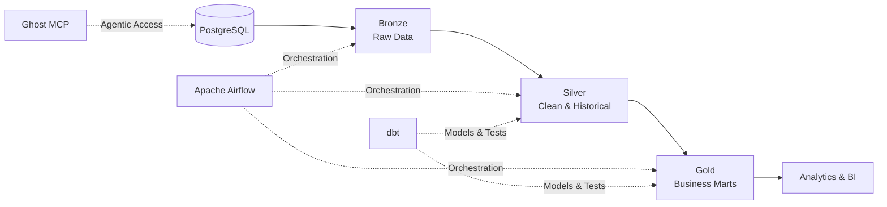

# 🛒 Walmart Analytics Lakehouse

### End-to-End Retail Data Engineering Platform

**PostgreSQL → Databricks → Delta Lake → dbt → Airflow**

*A production-inspired Modern Data Stack project for scalable retail analytics.*

---

## ✨ Overview

**Walmart Analytics Lakehouse** is an end-to-end data engineering project that transforms raw retail transactions into reliable, governed, and analytics-ready datasets.

The platform reproduces a modern enterprise environment using distributed processing, incremental ingestion, dimensional modeling, automated testing, and workflow orchestration.

### 🎯 Business objectives

- Centralize sales, product, store, and customer data
- Deliver trusted revenue, margin, and profitability metrics
- Preserve historical changes in prices and store information
- Automate the complete daily data lifecycle
- Provide clean datasets for reporting and business intelligence

---

## 🏗️ Architecture

### Data journey

| Stage | Purpose |
|---|---|
| 🗄️ **PostgreSQL** | Operational source for sales, stores, products, and customers |
| 🥉 **Bronze** | Immutable raw data with ingestion and lineage metadata |
| 🥈 **Silver** | Cleaned, typed, deduplicated, and historically tracked data |
| 🥇 **Gold** | Business-ready star schema and certified retail metrics |
| 📊 **Analytics** | Trusted datasets for dashboards, reporting, and decision-making |

---

## 🧱 Medallion Architecture

### 🥉 Bronze — Raw & Traceable

The Bronze layer preserves source data in its original form using Delta Lake.

**Key capabilities:**

- Append-only ingestion
- Full source traceability
- Ingestion timestamps
- Source identifiers
- Record checksums
- Reliable replay after failures

### 🥈 Silver — Clean & Historical

The Silver layer creates standardized and dependable domain datasets.

**Key capabilities:**

- Strict data typing
- Deduplication and validation
- Invalid-record quarantine
- Incremental CDC processing
- Delta Lake upserts
- SCD Type 1 for current-state corrections
- SCD Type 2 for product-price and store-address history

### 🥇 Gold — Business Ready

The Gold layer presents a dimensional model optimized for analytics.

**Dimensions:**

- `dim_products`
- `dim_stores`
- `dim_date`
- `dim_customers`

**Fact table:**

- `fact_sales`

**Certified metrics:**

- Gross sales
- Net revenue
- Units sold
- Cost amount
- Gross margin
- Profit rate

---

## ⚡ Technical Highlights

| Capability | Implementation |
|---|---|
| 🤖 **Agentic access** | Ghost MCP enables natural-language interaction with PostgreSQL through VS Code |
| 🚀 **Fast ingestion** | Python and PostgreSQL bulk loading support high-volume data generation and ingestion |
| 🔄 **Incremental processing** | Delta Lake CDC and idempotent upserts minimize unnecessary computation |
| 🕰️ **Historical tracking** | SCD Type 1 and Type 2 preserve accurate business context over time |
| 🧩 **Modular transformation** | dbt organizes reusable models, macros, documentation, and tests |
| 🎛️ **Automated orchestration** | Airflow controls Databricks jobs through the Databricks SDK |
| 🛡️ **Data governance** | Unity Catalog manages ownership, permissions, discovery, and lineage |
| 📦 **Reproducible environment** | Python 3.12 and `uv` provide fast, deterministic dependency management |

---

## 🔄 Daily Workflow

The Airflow pipeline runs once per day with automatic recovery controls.

1. **Ingest** operational data into Bronze
2. **Clean and reconcile** records in Silver
3. **Apply CDC and SCD** business rules
4. **Build** Gold dimensions and facts with dbt
5. **Validate** quality, relationships, and financial metrics
6. **Publish** certified datasets for analytics

### Orchestration policy

- Daily schedule
- No historical backfill by default
- Three automatic retries
- Remote Databricks job submission
- Run monitoring until successful completion
- Clear separation between orchestration and processing

---

## 🗂️ Project Structure

| Directory | Responsibility |
|---|---|
| `dags/` | Airflow workflow definitions |
| `dbt_project/` | Models, macros, tests, snapshots, and documentation |
| `notebooks/` | Databricks ingestion and transformation workloads |
| `scripts/` | Database seeding and environment utilities |
| `config/` | Non-sensitive runtime configuration |
| `sql/` | DDL and analytical queries |
| `tests/` | Python unit and integration tests |

---

## 🚀 Getting Started

### Prerequisites

- Python 3.12
- `uv`
- PostgreSQL
- Databricks workspace with Unity Catalog
- Databricks SQL Warehouse
- dbt Core with the Databricks adapter
- Apache Airflow

### Deployment sequence

1. Clone the repository
2. Install dependencies with `uv`
3. Configure PostgreSQL and Databricks environment variables
4. Seed the operational database
5. Create the Bronze, Silver, and Gold schemas
6. Run the dbt models and quality tests
7. Initialize Airflow
8. Enable the daily lakehouse pipeline

> 🔐 Secrets are stored outside version control through environment variables, Airflow connections, or an enterprise secret manager.

---

## 🛡️ Data Quality & Governance

The project applies quality controls before data reaches the Gold layer.

### Automated controls

- Primary-key uniqueness
- Mandatory-field validation
- Dimension-to-fact relationships
- Accepted business values
- Non-negative financial measures
- Source-to-Gold revenue reconciliation
- SCD validity-window integrity
- Freshness monitoring
- Duplicate detection
- Invalid-record quarantine

### Governance principles

- Centralized access control with Unity Catalog
- Least-privilege permissions
- End-to-end lineage
- Auditable batch identifiers
- Sensitive customer-data protection
- Clear ownership of data products
- Controlled schema evolution

---

## 📊 Analytics Use Cases

The Gold layer supports high-value retail analysis such as:

- 🏆 Top stores by revenue and gross margin
- 📈 Monthly and yearly sales trends
- 🧺 Product and category performance
- 👥 Customer segmentation and loyalty analysis
- 💰 Price-change impact on demand and profitability
- 🚨 Store-performance anomaly detection
- 🌍 Regional sales comparisons
- 📦 Units sold and product-mix analysis

---

## 🔐 Production Readiness

The architecture is designed around enterprise engineering principles:

- Idempotent processing
- Incremental workloads
- Secure secret management
- Automated retries
- Data contracts
- Layered access control
- Reproducible dependencies
- Structured observability
- Failure recovery
- Scalable distributed processing

---

## 👤 Author

### **Amine Ait Ali**

**Data Engineering Student**  
*Modern Data Stack · Lakehouse Architecture · Analytics Engineering*

This project showcases practical experience with distributed processing, dimensional modeling, data orchestration, governance, and quality engineering.

**PostgreSQL · Python · Apache Spark · Databricks · Delta Lake · dbt · Apache Airflow**

---

## 📚 Core Technologies

[Databricks](https://www.databricks.com/) •
[Delta Lake](https://delta.io/) •
[Apache Spark](https://spark.apache.org/) •
[dbt](https://www.getdbt.com/) •
[Apache Airflow](https://airflow.apache.org/) •
[PostgreSQL](https://www.postgresql.org/) •
[uv](https://docs.astral.sh/uv/)

---

### ⭐ Built as a portfolio-grade reference architecture for modern retail data engineering.

